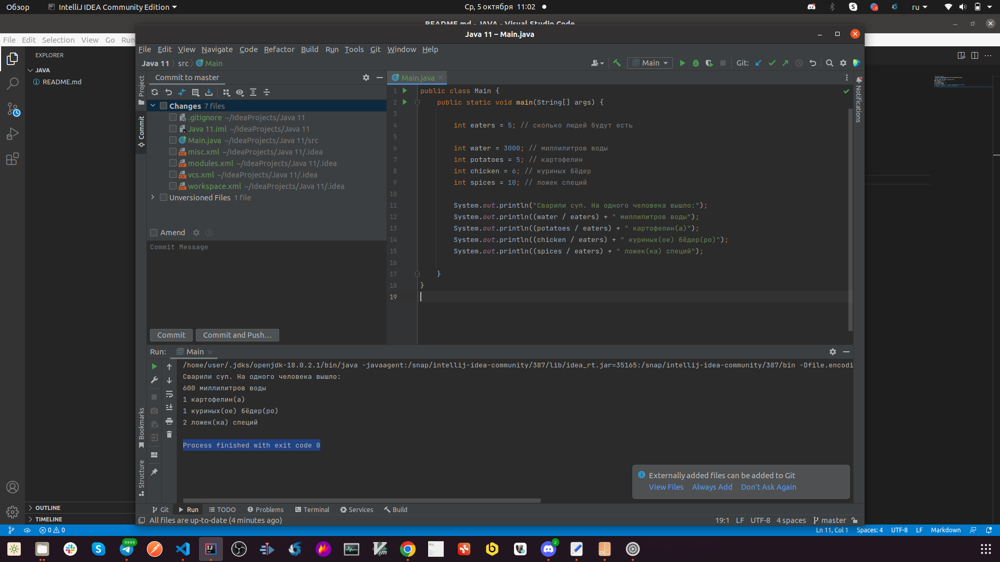

## Локация дефекта
 /home/user/IdeaProjects/Java 11/out/production/Java 1
 ## Шаги воспроизведения
 Сварили суп. На одного человека вышло:
600 миллилитров воды
1 картофелин(а)
1 куриных(ое) бёдер(ро)
2 ложек(ка) специй

## Фактический результат: Process finished with exit code 0
## Ожидаемый результат: Остаток 1 куриное бедро

## Скрин:

###  **Окружение:**

Операционная система Ubuntu 21.04

IDE: IntelliJ IDEA 2020.2(Community Edition)

Java: OpenJDK11# Описание
Некорректно рассчитана порция на одного человека по заданному рецепту

# Локация дефекта
 https://github.com/Evgenia450/JAVA/blob/main/Main.java#L8

# Шаги воспроизведения

1. Открыть [код программы](https://github.com/Evgenia450/JAVA/blob/main/Main.java)
1. Запустить программу
1. Посмотреть на вывод в консоли

* Фактический результат: Process finished with exit code 0
* Ожидаемый результат: Остаток 1 куриное бедро

# Скриншот

# Окружение
* **Операционная система:** Ubuntu 21.04
* **IDE:** IntelliJ IDEA 2020.2(Community Edition)
* **Java:** OpenJDK11

